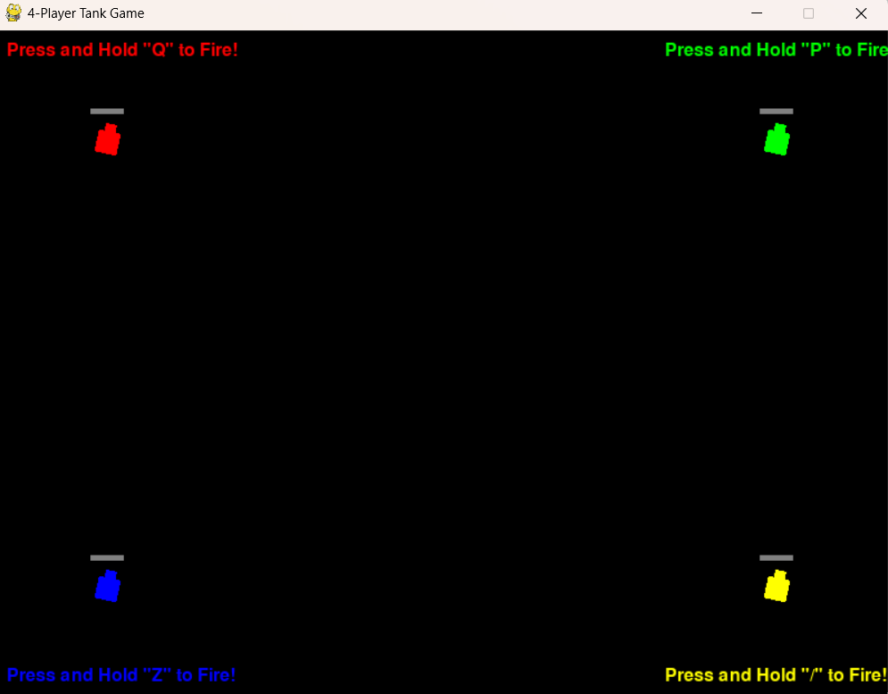
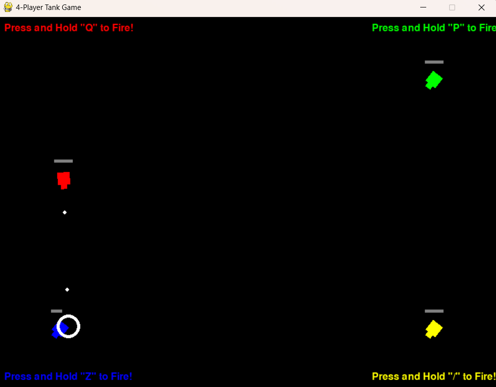
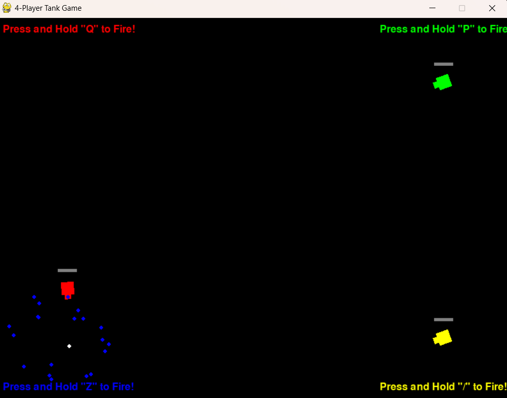
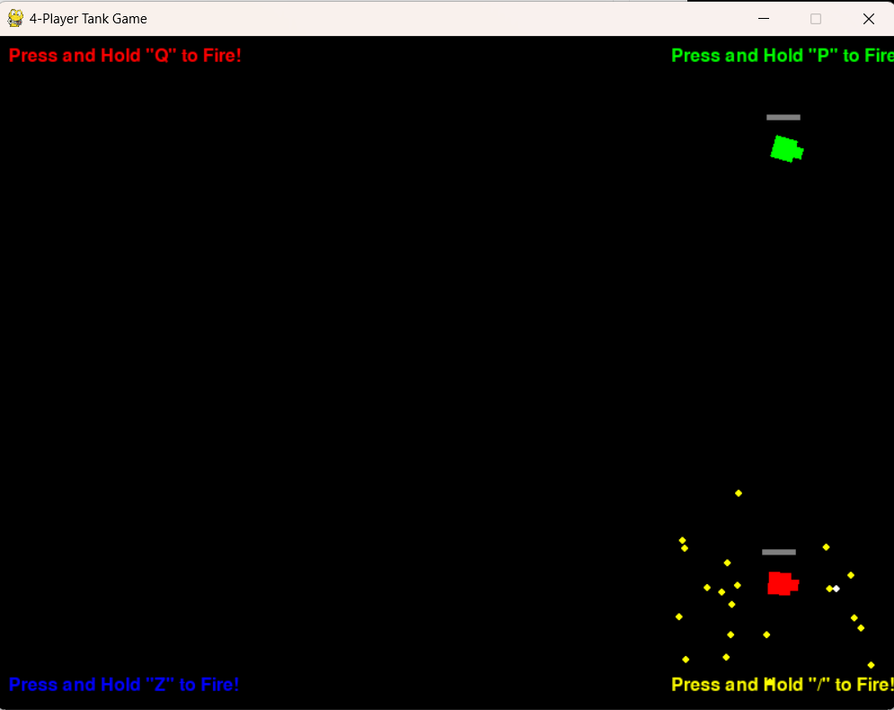
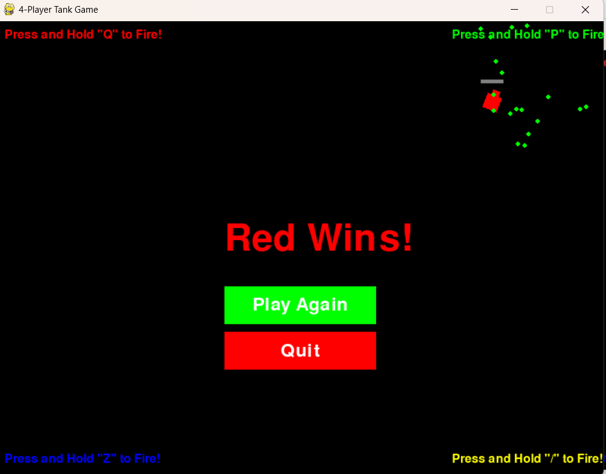

# Tank of Tanks

**Tank of Tanks** is a local multiplayer tank battle game where up to four players can compete on the same screen! Each player controls a mini tank, spins to aim, and fires bullets to eliminate opponents. The last tank standing wins the game!

This project is inspired by the original game [Tank of Tanks Battle](https://apps.apple.com/gb/app/tank-of-tanks-battle/id1037969174), developed by **Orion Game** and available on the App Store. This open-source implementation is built using Python and Pygame for educational and non-commercial purposes.

## Public Link on Trinket
[Click This](https://trinket.io/pygame/5e137a431c01?outputOnly=true&showInstructions=true) and click on "Run" to try out the game!

## Screenshots






## Features

- **Multiplayer Fun**: Up to 4 players can play simultaneously using keyboard controls.
- **Simple Controls**: Each player has one key to press and hold for moving forward and firing bullets.
- **Dynamic Gameplay**:
  - Tanks spin when idle, reversing spinning direction after each stop.
  - Bullets cause explosions when hitting enemy tanks.
  - Tanks collide and bounce off each other dynamically.
- **Health Bars**: Each tank has a health bar displayed above it.
- **Victory Screen**: Displays the winning tank and allows players to rematch or quit.

## Controls

Each player controls their tank using a single key:

- **Player 1 (Red)**: Press and hold `Q` to move forward and fire.
- **Player 2 (Green)**: Press and hold `P` to move forward and fire.
- **Player 3 (Blue)**: Press and hold `Z` to move forward and fire.
- **Player 4 (Yellow)**: Press and hold `/` to move forward and fire.

When a key is released, the corresponding tank stops moving forward and starts spinning again.

## How to Play

1. Run the game using Python (requires Pygame).
2. Each player controls their tank using their assigned key.
3. Aim by spinning your tank, then press your key to move forward and fire bullets.
4. Bullets reduce enemy tanks' health on impact. Tanks are destroyed when their health reaches zero.
5. The last surviving tank wins the round!
6. After a round ends, click "Rematch" to restart or "Quit" to exit.

## Installation

### Prerequisites
- Python 3.12
- Pygame 2.5.2

### Steps
1. Clone this repository:
   ```
   git clone <repository-url>
   ```
2. Navigate to the project folder:
   ```
   cd <project-folder>
   ```
3. Install Pygame:
   ```
   pip install pygame
   ```
4. Run the game:
   ```
   python main.py
   ```

## Credits

This project was inspired by [Tank of Tanks Battle](https://apps.apple.com/gb/app/tank-of-tanks-battle/id1037969174), developed by **Orion Game**. The original game is available on iOS devices via the App Store.

The original game features cartoon-like graphics, simple mechanics, and fun multiplayer gameplay that served as inspiration for this open-source reimplementation using Python and Pygame.

This project is an independent creation intended for educational purposes, with no affiliation or endorsement from Orion Game.

## License

This project is licensed under the Apache License 2.0. See the `LICENSE` file for more details.
